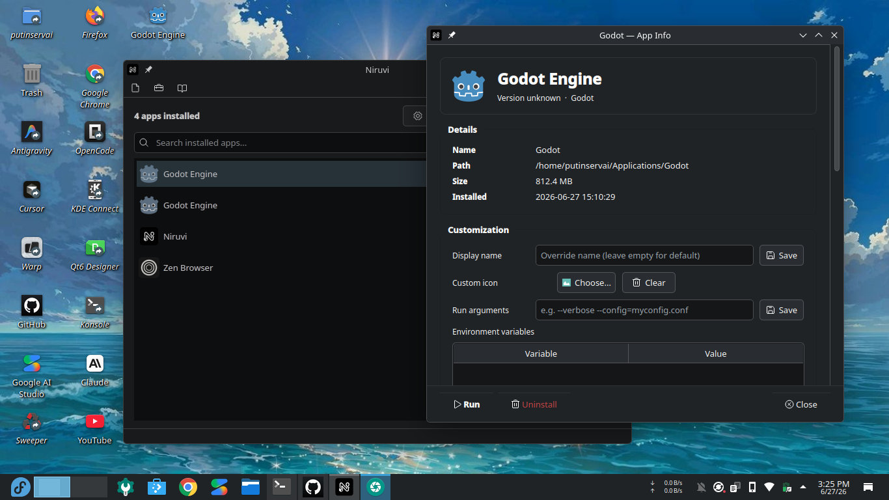
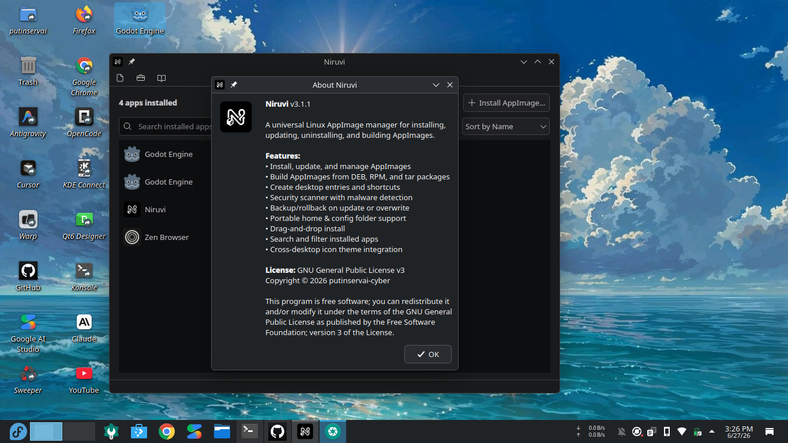
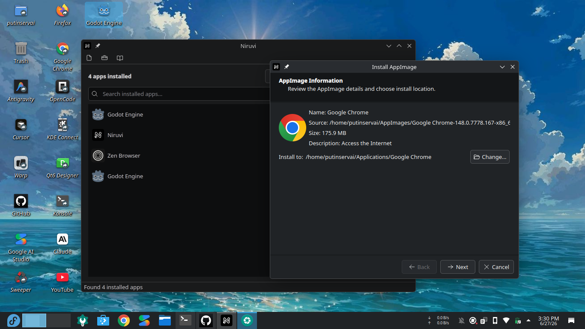

# Niruvi — Universal Linux AppImage Manager

<p align="center">
  
</p>

Niruvi is a desktop application for **installing**, **managing**, **updating**, and **building**
AppImage applications on Linux. It combines a clean Qt6 interface with robust safety features
and a powerful AppImage builder that supports both traditional packages and local project folders.

---

## What Niruvi Does

AppImage is a portable application format for Linux — just download, make executable, and run.
Niruvi makes this workflow smarter:

- **Install AppImages** with desktop integration — automatic `.desktop` entries, launcher icons,
  and optional shortcuts. Your apps appear in your system menu just like native software.
- **Build AppImages** from DEB packages, RPM packages, tar archives, or even a local project
  folder — no packaging expertise needed.
- **Create self-installing AppImages** that prompt the user to install on first run, with a
  professional wizard, license acceptance, component selection, and optional auto-updater.
- **Keep your apps up to date** with automatic update checking and SHA256-verified downloads.
- **Remove apps cleanly** when you no longer need them — no leftover files, no orphaned
  desktop entries.

---

## Features

### App Management
- **Drag-and-drop install** — drop an `.AppImage` file onto the window to start installation
- **Desktop integration** — automatic `.desktop` entries, desktop shortcuts, and XDG icon theme support
- **Search and sort** — quickly find apps by name, sort by name or version
- **Right-click context menu** — Run, Update, Uninstall, Open Folder, and toggle Desktop Shortcut
- **Portable folders** — optional `.home` and `.config` folders keep app data self-contained
- **CLI mode** — headless install via `--install` for scripting and remote environments

### AppImage Builder
- **Multiple source formats** — build from DEB, RPM, tar archives, or a local project folder
- **Self-installing format** — create AppImages that install themselves with full desktop integration
- **Installer styles**:
  — **Wizard**: zenity/kdialog dialogs, simple and compatible
  — **macOS style**: step-by-step flow with progress bar
  — **Minimal**: terminal-only, works over SSH
  — **InstallBuilder style**: professional multi-page wizard with Back/Next navigation
- **Advanced options** — brand name, license/EULA, pre/post-install scripts, optional components,
  custom messages, rollback protection, silent mode, and auto-updater with SHA256 verification
- **Post-build verification** — automatically checks ELF header, executable permissions, and runs
  a version test to confirm the AppImage works

### Safety & Security
- **Static analysis security scanner** — examines AppImage contents for suspicious patterns,
  setuid binaries, and known malicious filenames *without executing the unpackaged code*
- **SHA256 verification** — every downloaded update is hash-verified before installation
- **Backup and rollback** — previous versions are backed up before updates and restored on failure
- **Atomic writes** — registry and metadata are written atomically to prevent corruption
- **Input sanitization** — all user-provided values are sanitized before being used in generated scripts
- **No telemetry** — Niruvi does not collect usage data, call home, or share any information

### Health Monitoring & Diagnostics
- **Health checks** — apps with no updates for 60+ days are flagged in the app list
- **Multi-fallback execution** — automatically tries FUSE → namespace → temp extraction if a
  method fails
- **GPU diagnostics** — OpenGL and Vulkan device info shown in each app's info dialog

### Runtime Hooks
- **Pre-launch hooks** — place executable `.hook` scripts in `~/.config/niruvi/hooks/` to run
  before app launch. Hooks receive `APP_NAME` and `APP_DIR` environment variables.

### User Interface
- **Built-in help system** — press F1 for comprehensive documentation on all features
- **Error report dialog** — detailed, human-readable error messages with step-by-step fix suggestions
- **Build summary dialog** — post-build results with file size, validation status, and quick tips
- **Report Issue page** — one-click access to the GitHub issues page with diagnostic information

---

## Screenshots

<p align="center">
  
</p>

<p align="center">
  
</p>

<p align="center">
  
</p>

---

## Requirements

- **Python 3.10+**
- **PyQt6 ≥ 6.5**
- **Linux** with FUSE (for AppImage extraction)
- **appimagetool** — included in the `asset/` directory for building AppImages

Optional dependencies:
- `librsvg` (`rsvg-convert`) — better SVG icon conversion
- `unsquashfs` — enables static security scanning without executing AppImages
- `ClamAV` (`clamscan`) — optional malware scanning

---

## Installation

### From the AppImage (recommended)

Download the latest `Niruvi-x86_64.AppImage` from the releases page, make it executable,
and run:

```bash
chmod +x Niruvi-x86_64.AppImage
./Niruvi-x86_64.AppImage
```

The first time you run it, Niruvi will prompt you to install it. After installation,
it appears in your application menu.

### From source

```bash
git clone https://github.com/putinservai-cyber/niruvi.git
cd niruvi
pip install .
niruvi
```

### Run directly (no install)

```bash
git clone https://github.com/putinservai-cyber/niruvi.git
cd niruvi
python3 niruvi.py
```

---

## Usage

### Graphical interface

```bash
niruvi                          # Launch the main window
niruvi MyApp.AppImage           # Launch and open an AppImage for installation
```

### Command-line

```bash
niruvi --install MyApp.AppImage    # Install silently (no GUI)
niruvi --uninstall AppName         # Remove an installed application
niruvi --version                   # Show the current version
```

### Keyboard shortcuts

| Key | Action |
|-----|--------|
| `Ctrl+I` | Install an AppImage |
| `Ctrl+R` | Refresh the installed apps list |
| `Ctrl+Q` | Quit Niruvi |
| `F1` | Open the built-in help system |

---

## Building AppImages

### From a package file

1. Open **Tools → Build AppImage** or click the **Build** button
2. Select **Package file** as the source type
3. Choose a DEB, RPM, or tar archive
4. Set the app name and version (auto-detected if left empty)
5. Optionally enable **Self-Installing AppImage** and configure the installer style
6. Click **Build AppImage**

### From a project folder

1. Open **Tools → Build AppImage**
2. Select **Project folder** as the source type
3. Browse to your project directory
4. Niruvi analyzes the folder — file count, size, and detects entry points
5. The folder contents are copied directly into the AppDir
6. If no `AppRun` exists, Niruvi auto-creates one based on detected executables

### Self-installing AppImages

Enable **Self-Installing AppImage** to create an AppImage that installs itself
on first run. This is ideal for applications that need:

- Desktop integration (launcher entries, icons)
- A managed install lifecycle with uninstaller
- End-user license agreement acceptance
- Optional component selection during install
- Automatic background updates

---

## Configuration

Settings are stored in `~/.config/niruvi/settings.json`. Open **File → Settings** to adjust:

| Setting | Default | Description |
|---------|---------|-------------|
| `install_dir` | `~/Applications` | Where installed apps are stored |
| `build_output_dir` | `~/Applications` | Default output directory for built AppImages |
| `create_desktop` | `true` | Create a `.desktop` entry on install |
| `create_shortcut` | `false` | Create a desktop shortcut on install |
| `portable_home` | `false` | Create a `.home` folder for app data |
| `portable_config` | `false` | Create a `.config` folder for app settings |
| `icon_in_theme` | `true` | Install app icons to the XDG icon theme |
| `check_updates` | `true` | Automatically check for Niruvi updates |

---

## Security

Niruvi takes security seriously:

- **Static analysis only** — the security scanner examines AppImage contents by extracting
  the embedded filesystem image directly, without executing the AppImage binary. This means
  potentially malicious code never runs during the scan.
- **SHA256 verification** — all update downloads are verified against their expected hash
  before installation. If the hash doesn't match, the download is rejected.
- **Backup and rollback** — before any update or overwrite, the current version is backed up.
  If the update fails, the previous version is automatically restored.
- **Input sanitization** — all user-provided values (app names, version strings, file paths)
  are sanitized before being embedded in generated scripts, preventing injection attacks.
- **No telemetry** — Niruvi does not collect any usage data, send analytics, or communicate
  with any server except for explicit update checks and the GitHub issues page.

---

## Project Structure

```
niruvi/                         # Core application package
├── __init__.py                 # Package exports
├── __main__.py                 # Entry point for `python -m niruvi`
├── _version.py                 # Version string
├── appimage_assets.py          # Asset extraction from AppImage files
├── appimage_metadata.py        # ELF header parsing and metadata
├── app_info_dialog.py          # App info dialog (details, customization, GPU)
├── background_updater.py       # Background update checker thread
├── build_dialog.py             # AppImage build dialog (Qt6 UI)
├── build_page.py               # Build worker thread and utilities
├── builder_bootstrap.py        # Install script generation
├── constants.py                # Application-wide constants
├── desktop_utils.py            # .desktop entry and shortcut management
├── health_check.py             # App health monitoring (staleness, FUSE check)
├── help_dialog.py              # Built-in help system and license viewer
├── hooks.py                    # Runtime hooks system (pre-launch scripts)
├── icon_utils.py               # Icon format conversion utilities
├── installation_registry.py    # JSON-based installation registry
├── main.py                     # CLI entry point and argument parsing
├── manager.py                  # Main window (AppManager)
├── report_dialog.py            # Error report and build summary dialogs
├── report_page.py              # GitHub issues reporting page
├── scanner.py                  # Static security analysis
├── self_install.py             # Self-installing AppImage logic
├── self_installer_wizard.py    # Self-installer Qt6 wizard
├── self_update.py              # Automatic update checking and installation
├── settings.py                 # Settings management
├── toggle_switch.py            # Toggle switch widget
├── uninstall_dialog.py         # Uninstall wizard
├── update_sources.py           # Update source resolution (GitHub/GitLab/direct)
├── utils.py                    # General utility functions
├── wizard.py                   # Installation wizard
└── worker.py                   # Extraction worker thread
asset/                          # Build assets
├── LICENSE                     # GPL-3.0 license file
├── appimagetool-x86_64.AppImage
├── niruvi.desktop
├── niruvi.png
├── niruvi.svg
├── screenshot/                 # Application screenshots
│   ├── Screenshot_20260627_152504.png
│   ├── Screenshot_20260627_152628.png
│   └── Screenshot_20260627_153009.png
└── icons/                      # Phosphor icon theme (52 icons)
```

---

## Building Niruvi as an AppImage

To package Niruvi itself as an AppImage:

```bash
./build-appimage.sh
```

This creates `Niruvi-x86_64.AppImage` in the project root.

---

## License

Copyright (c) 2025 putinservai-cyber.

This program is free software: you can redistribute it and/or modify
it under the terms of the GNU General Public License as published by
the Free Software Foundation, either version 3 of the License, or
(at your option) any later version.

This program is distributed in the hope that it will be useful,
but WITHOUT ANY WARRANTY; without even the implied warranty of
MERCHANTABILITY or FITNESS FOR A PARTICULAR PURPOSE. See the
GNU General Public License for more details.

You should have received a copy of the GNU General Public License
along with this program. If not, see <https://www.gnu.org/licenses/>.

Niruvi incorporates the following open-source components:
- **PyQt6** — licensed under the GNU GPL v3
- **appimagetool** — licensed under the MIT License

---

## Support

- **Documentation**: Press `F1` within the application
- **Bug reports**: Use **Help → Report Issue** from the menu bar
- **GitHub**: [https://github.com/putinservai-cyber/niruvi](https://github.com/putinservai-cyber/niruvi)
