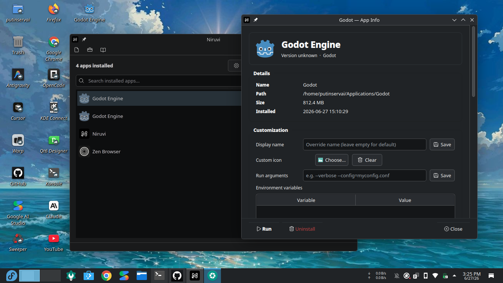
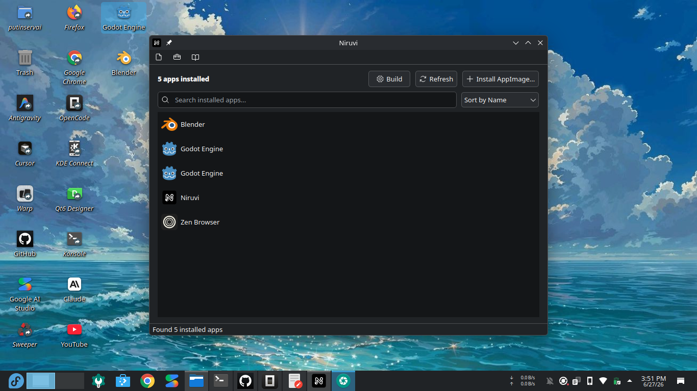
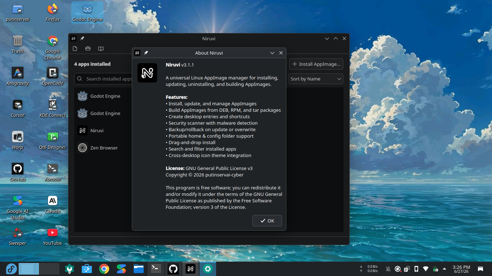
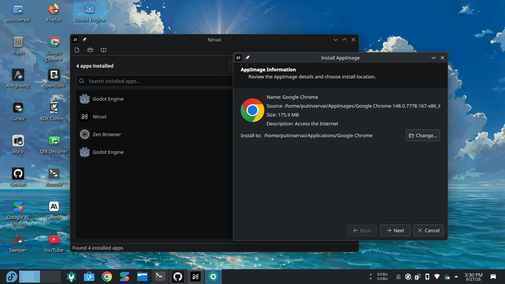

# Niruvi — Universal Linux AppImage Manager

<p align="center">
  
</p>

<p align="center">
  <a href="https://ko-fi.com/putinservai">
    
  </a>
  
  </a>
  <a href="https://github.com/putinservai-cyber/niruvi/releases">
    
  </a>
  
</p>

Niruvi is a desktop application for **installing**, **managing**, **updating**, and **building**
AppImage applications on Linux. It combines a clean Qt6 interface with robust safety features
and a powerful AppImage builder that supports both traditional packages and local project folders.

---

## What Niruvi Does

AppImage is a portable application format for Linux — just download, make executable, and run.
Niruvi makes this workflow smarter:

- **Install AppImages** with desktop integration — automatic `.desktop` entries, launcher icons,
  and optional shortcuts. Your apps appear in your system menu just like native software.
- **Build AppImages** from DEB packages, RPM packages, tar archives, or even a local project
  folder — no packaging expertise needed.
- **Keep your apps up to date** with automatic update checking and SHA256-verified downloads.
- **Remove apps cleanly** when you no longer need them — no leftover files, no orphaned
  desktop entries.

---

## Features

### App Management
- **Drag-and-drop install** — drop an `.AppImage` file onto the window to start installation
- **Desktop integration** — automatic `.desktop` entries, desktop shortcuts, and XDG icon theme support
- **Search and sort** — quickly find apps by name, sort by name or version
- **Right-click context menu** — Run, Update, Uninstall, Open Folder, and toggle Desktop Shortcut
- **Portable folders** — optional `.home` and `.config` folders keep app data self-contained
- **CLI mode** — headless install via `--install` for scripting and remote environments

### AppImage Builder
- **Multiple source formats** — build from DEB, RPM, tar archives, or a local project folder
- **Post-build verification** — automatically checks ELF header, executable permissions, and runs
  a version test to confirm the AppImage works

### Safety & Security
- **Static analysis security scanner** — examines AppImage contents for suspicious patterns,
  setuid binaries, and known malicious filenames *without executing the unpackaged code*
- **SHA256 verification** — every downloaded update is hash-verified before installation
- **Backup and rollback** — previous versions are backed up before updates and restored on failure
- **Atomic writes** — registry and metadata are written atomically to prevent corruption
- **Input sanitization** — all user-provided values are sanitized before being used in generated scripts
- **No telemetry** — Niruvi does not collect usage data, call home, or share any information

### Health Monitoring & Diagnostics
- **Health checks** — apps with no updates for 60+ days are flagged in the app list
- **Multi-fallback execution** — automatically tries FUSE → namespace → temp extraction if a
  method fails
- **GPU diagnostics** — OpenGL and Vulkan device info shown in each app's info dialog

### Runtime Hooks
- **Pre-launch hooks** — place executable `.hook` scripts in `~/.config/niruvi/hooks/` to run
  before app launch. Hooks receive `APP_NAME` and `APP_DIR` environment variables.

### User Interface
- **Built-in help system** — press F1 for comprehensive documentation on all features
- **Error report dialog** — detailed, human-readable error messages with step-by-step fix suggestions
- **Build summary dialog** — post-build results with file size, validation status, and quick tips
- **Report Issue page** — one-click access to the GitHub issues page with diagnostic information

---

## Screenshots

<p align="center">
  
</p>

<p align="center">
  
</p>

<p align="center">
  
</p>

<p align="center">
  
</p>

---

## Requirements

- **Python 3.10+**
- **PyQt6 ≥ 6.5**
- **Linux** with FUSE (for AppImage extraction)
- **appimagetool** — included in the `asset/` directory for building AppImages

Optional dependencies:
- `librsvg` (`rsvg-convert`) — better SVG icon conversion
- `unsquashfs` — enables static security scanning without executing AppImages
- `ClamAV` (`clamscan`) — optional malware scanning

---

## Installation

### From the AppImage (recommended)

Download the latest `Niruvi-x86_64.AppImage` from the releases page, make it executable,
and run:

```bash
chmod +x Niruvi-x86_64.AppImage
./Niruvi-x86_64.AppImage
```

The first time you run it, Niruvi will prompt you to install it. After installation,
it appears in your application menu.

### From source

```bash
git clone https://github.com/putinservai-cyber/niruvi.git
cd niruvi
pip install .
niruvi
```

### Run directly (no install)

```bash
git clone https://github.com/putinservai-cyber/niruvi.git
cd niruvi
python3 niruvi.py
```

---

## Usage

### Graphical interface

```bash
niruvi                          # Launch the main window
niruvi MyApp.AppImage           # Launch and open an AppImage for installation
```

### Command-line

```bash
niruvi --install MyApp.AppImage    # Install silently (no GUI)
niruvi --uninstall AppName         # Remove an installed application
niruvi --version                   # Show the current version
```

### Keyboard shortcuts

| Key | Action |
|-----|--------|
| `Ctrl+I` | Install an AppImage |
| `Ctrl+R` | Refresh the installed apps list |
| `Ctrl+B` | Build an AppImage |
| `Ctrl+U` | Uninstall selected app |
| `Ctrl+D` | Show app info/details |
| `Ctrl+O` | Open app's install folder |
| `Ctrl+Q` | Quit Niruvi |
| `F1` | Open the built-in help system |

---

## Building AppImages

### From a package file

1. Open **Tools → Build AppImage** or click the **Build** button
2. Select **Package file** as the source type
3. Choose a DEB, RPM, or tar archive
4. Set the app name and version (auto-detected if left empty)
5. Click **Build AppImage**

### From a project folder

1. Open **Tools → Build AppImage**
2. Select **Project folder** as the source type
3. Browse to your project directory
4. Niruvi analyzes the folder — file count, size, and detects entry points
5. The folder contents are copied directly into the AppDir
6. If no `AppRun` exists, Niruvi auto-creates one based on detected executables

---

## Configuration

Settings are stored in `~/.config/niruvi/settings.json`. Open **File → Settings** to adjust:

| Setting | Default | Description |
|---------|---------|-------------|
| `install_dir` | `~/Applications` | Where installed apps are stored |
| `build_output_dir` | `~/Applications` | Default output directory for built AppImages |
| `create_desktop` | `true` | Create a `.desktop` entry on install |
| `create_shortcut` | `false` | Create a desktop shortcut on install |
| `portable_home` | `false` | Create a `.home` folder for app data |
| `portable_config` | `false` | Create a `.config` folder for app settings |
| `icon_in_theme` | `true` | Install app icons to the XDG icon theme |
| `check_updates` | `true` | Automatically check for Niruvi updates |

The installed-app registry is stored in `~/.config/niruvi/registry.db`
(SQLite with per-row HMAC integrity checks; legacy `registry.json` files are
auto-migrated on first run).

---

## Security

Niruvi takes security seriously:

- **Static analysis only** — the security scanner examines AppImage contents by extracting
  the embedded filesystem image directly, without executing the AppImage binary. This means
  potentially malicious code never runs during the scan.
- **SHA256 verification** — all update downloads are verified against their expected hash
  before installation. If the hash doesn't match, the download is rejected.
- **Backup and rollback** — before any update or overwrite, the current version is backed up.
  If the update fails, the previous version is automatically restored.
- **Input sanitization** — all user-provided values (app names, version strings, file paths)
  are sanitized before being embedded in generated scripts, preventing injection attacks.
- **No telemetry** — Niruvi does not collect any usage data, send analytics, or communicate
  with any server except for explicit update checks and the GitHub issues page.

---

## Project Structure

```
niruvi/                         # Core application package
├── __init__.py                 # Package exports
├── __main__.py                 # Entry point for `python -m niruvi`
├── _version.py                 # Version string
├── main.py                     # CLI entry point and argument parsing
├── launcher.py                 # Headless sandbox-aware app launcher (--run)
├── app/                        # Background services
│   ├── background_updater.py   # Background update checker thread
│   ├── health_check.py         # App health monitoring (staleness, FUSE check)
│   ├── self_install.py         # Self-installing AppImage logic
│   ├── self_update.py          # GPG-verified Niruvi self-update
│   ├── store.py                # App store catalog
│   ├── tags.py                 # App category tags
│   ├── update_sources.py       # Update source resolution (GitHub/GitLab/direct)
│   └── virustotal.py           # Opt-in VirusTotal scanning
├── build/                      # AppImage builder
│   ├── page.py                 # Build worker thread, package extraction
│   └── appimage_builder.py     # AppDir assembly
├── core/                       # Business logic (no UI)
│   ├── broker.py               # Sandbox permission broker daemon
│   ├── hooks.py                # Pre-launch hook system
│   ├── manifest.py             # AppDir manifest validation
│   ├── plugins.py              # Plugin event system
│   ├── repair.py               # App repair / re-integration
│   ├── sandbox.py              # Shield/firejail/bwrap sandbox backends
│   ├── scanner.py              # Static security analysis (no execution)
│   ├── verification.py         # SHA-256 / GPG / desktop-file verification
│   └── worker.py               # Extraction/download QThread workers
├── desktop/                    # XDG desktop integration
│   ├── appimage_assets.py      # Asset extraction from AppImages
│   ├── appimage_metadata.py    # ELF/AppImage header parsing
│   ├── desktop_utils.py        # .desktop entries, icons, MIME handlers
│   ├── icon_utils.py           # Icon format conversion
│   ├── installation_registry.py # SQLite registry (HMAC-signed rows)
│   └── zsync.py                # Delta downloads via zsync/HTTP Range
├── installer/                  # Generated install scripts
│   ├── junest.py               # JuNest container path validation
│   ├── sanitize.py             # Shell-injection-safe string sanitization
│   └── scripts.py              # Install script template generation
├── ui/                         # PyQt6 widgets/dialogs
│   ├── manager.py              # Main window (AppManager)
│   ├── settings.py             # Settings dialog
│   ├── wizard.py               # Install wizard
│   ├── build_wizard.py         # Build wizard
│   ├── store_dialog.py         # App store dialog
│   ├── self_installer_wizard.py# Self-installer wizard
│   ├── uninstall_dialog.py     # Uninstall wizard
│   ├── update_wizard.py        # App update wizard
│   ├── app_info_dialog.py      # App info / GPU diagnostics
│   ├── help_dialog.py          # Built-in help system
│   ├── report_dialog.py        # Error report / build summary
│   └── toggle_switch.py        # Toggle switch widget
├── utils/                      # Shared helpers
│   ├── http.py                 # Verified SSL HTTP helpers
│   ├── integrity.py            # HMAC signing/verification
│   ├── qt_compat.py            # Qt/AppImage platform-path shims
│   ├── sound_manager.py        # Sound effect playback
│   ├── styles.py               # Theme stylesheets
│   └── theme_engine.py         # Dark/light theme switching
tests/                          # Test suite (229 tests)
asset/                          # Build assets
├── appimagetool-x86_64.AppImage
├── niruvi.desktop
├── niruvi.png
├── niruvi.svg
├── screenshot/                 # Application screenshots
└── icons/                      # Phosphor icon theme (52 icons)
```

---

## Building Niruvi as an AppImage

To package Niruvi itself as an AppImage:

```bash
./build-appimage.sh
```

This creates `Niruvi-x86_64.AppImage` in the project root.

---

## License

Copyright © 2026 putinservai-cyber.

This program is free software: you can redistribute it and/or modify
it under the terms of the GNU General Public License as published by
the Free Software Foundation, either version 3 of the License, or
(at your option) any later version.

This program is distributed in the hope that it will be useful,
but WITHOUT ANY WARRANTY; without even the implied warranty of
MERCHANTABILITY or FITNESS FOR A PARTICULAR PURPOSE. See the
GNU General Public License for more details.

You should have received a copy of the GNU General Public License
along with this program. If not, see <https://www.gnu.org/licenses/>.

Niruvi incorporates the following open-source components:
- **PyQt6** — licensed under the GNU GPL v3
- **appimagetool** — licensed under the MIT License

---

## Support & Donations

Niruvi is developed and maintained by a single developer in their spare time.
It is **free and open source** (GPL-3.0), with no ads, no telemetry, and no
paywalls. If the project saves you time or you simply enjoy using it, please
consider supporting the work:

- ☕ **Buy me a coffee** — [ko-fi.com/putinservai](https://ko-fi.com/putinservai)
- ❤️ **Become a GitHub Sponsor** — [github.com/sponsors/putinservai-cyber](https://github.com/sponsors/putinservai-cyber)

Donations help cover hosting, code-signing keys, appimagetool tooling, and
development time. Every contribution — however small — is genuinely appreciated.
You can also support the project by:

- ⭐ **Starring the repository** on GitHub
- 🐛 **Reporting bugs** via **Help → Report Issue** or the [issue tracker](https://github.com/putinservai-cyber/niruvi/issues)
- 🌐 **Translating** the app or **improving the documentation**
- 💻 **Contributing code** — see [CONTRIBUTING.md](CONTRIBUTING.md)

Thank you! 🙏
